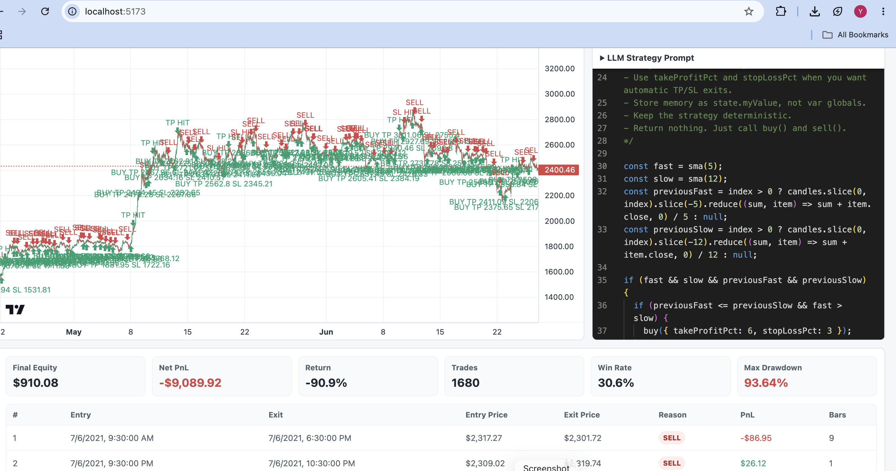

# Crypto Strategy Backtester

A full-stack crypto trading strategy backtester built with React, TypeScript, Vite, Express, Lightweight Charts, and Monaco Editor. The app lets users load OHLCV candle data, write JavaScript strategy logic in the browser, run a backtest, and review chart markers, trade history, and performance metrics.

## Screenshots

### Historical Candle Chart


### Strategy Editor


### Backtest Results Dashboard



## Why This Project Stands Out

- Built a complete frontend and backend workflow for testing trading ideas.
- Designed a browser-based strategy editor using Monaco Editor, similar to a lightweight TradingView-style scripting experience.
- Implemented a custom TypeScript backtesting engine that simulates long-only entries, exits, take-profit, stop-loss, commissions, equity curve tracking, and trade metrics.
- Integrated Lightweight Charts to visualize historical candles and buy/sell markers directly on the chart.
- Added CSV market data loading with fallback generated data, so the project can run even when a specific dataset is missing.
- Structured the codebase with clear separation between UI components, API services, market data parsing, route handlers, and backtesting logic.
- Included a built-in LLM prompt generator that helps users create compatible strategy code for the sandbox.

## Core Features

- Select crypto symbols such as `BTCUSDT` and `ETHUSDT`.
- Select common trading timeframes including `1m`, `5m`, `15m`, `1h`, `4h`, and `1d`.
- Load historical OHLCV candle data from CSV files.
- Edit strategy logic directly in the app using a Monaco-powered JavaScript editor.
- Run strategy backtests against historical candles.
- Display buy, sell, take-profit, stop-loss, and end-of-test markers on the chart.
- Review metrics including final equity, net PnL, total return, trade count, win rate, max drawdown, and profit factor.
- Review detailed trade history with entry price, exit price, exit reason, net PnL, and holding period.

## Tech Stack

| Layer | Tools |
| --- | --- |
| Frontend | React 19, TypeScript, Vite |
| Charting | Lightweight Charts |
| Code Editor | Monaco Editor |
| Backend | Node.js, Express, TypeScript |
| Data | CSV files parsed with `csv-parser` |
| Strategy Engine | Custom TypeScript backtest engine |
| Tooling | npm, concurrently, tsx |

## Project Structure

```text
.
├── Readme.md
├── Eth /
│   ├── BYBIT_ETHUSDT_15m.csv
│   ├── BYBIT_ETHUSDT_1h.csv
│   └── BYBIT_ETHUSDT_4h.csv
└── crypto-backtester/
    ├── backend/
    │   ├── data/
    │   ├── src/
    │   │   ├── engine/backtestEngine.ts
    │   │   ├── routes/apiRoutes.ts
    │   │   ├── services/marketDataService.ts
    │   │   ├── types/market.ts
    │   │   └── server.ts
    │   └── package.json
    ├── frontend/
    │   ├── src/
    │   │   ├── components/
    │   │   ├── services/api.ts
    │   │   ├── types/market.ts
    │   │   ├── App.tsx
    │   │   └── main.tsx
    │   └── package.json
    └── package.json
```

## Prerequisites

Install these before running the project:

- Node.js 20 or newer recommended
- npm

Check your versions:

```bash
node --version
npm --version
```

## How To Run Locally

From the project root:

```bash
cd crypto-backtester
```

Install root, backend, and frontend dependencies:

```bash
npm install
npm install --prefix backend
npm install --prefix frontend
```

Start the frontend and backend together:

```bash
npm run dev
```

Open the frontend in your browser:

```text
http://localhost:5173
```

The backend runs on:

```text
http://localhost:4100
```

If Vite says port `5173` is busy, use the alternate local URL printed in the terminal.

## Run Frontend And Backend Separately

Start the backend:

```bash
cd crypto-backtester
npm run dev --prefix backend
```

Start the frontend in another terminal:

```bash
cd crypto-backtester
npm run dev --prefix frontend
```

## Build For Production

Build both backend and frontend:

```bash
cd crypto-backtester
npm run build
```

Start the compiled backend:

```bash
npm run start
```

To preview the frontend production build:

```bash
npm run preview --prefix frontend
```

## API Endpoints

| Method | Endpoint | Description |
| --- | --- | --- |
| `GET` | `/health` | Backend health check |
| `GET` | `/api/symbols` | Returns supported symbols |
| `GET` | `/api/timeframes` | Returns supported timeframes |
| `GET` | `/api/history?symbol=ETHUSDT&timeframe=1h` | Returns candle history |
| `POST` | `/api/backtest` | Runs strategy code against selected candles |

Example backtest request:

```bash
curl -X POST http://localhost:4100/api/backtest \
  -H "Content-Type: application/json" \
  -d '{
    "symbol": "ETHUSDT",
    "timeframe": "1h",
    "strategy": "const fast = sma(5); const slow = sma(12); if (fast && slow && !position && fast > slow) buy({ takeProfitPct: 6, stopLossPct: 3 }); if (position && fast && slow && fast < slow) sell();"
  }'
```

## Strategy Sandbox

Strategy code runs once per candle from oldest to newest. The sandbox exposes:

- `candle`: current OHLCV candle
- `candles`: full candle array
- `index`: current candle index
- `position`: current open long position, or `null`
- `state`: persistent object for strategy memory
- `buy()`: opens a long position at the current close
- `buy({ takeProfitPct, stopLossPct })`: opens a long position with automatic risk exits
- `sell()`: closes the open position at the current close
- `sma(period)`: simple moving average of close prices
- `sma(period, source)`: simple moving average using `open`, `high`, `low`, `close`, or `volume`

Example strategy:

```js
const fast = sma(5);
const slow = sma(12);

if (!fast || !slow) {
  return;
}

if (!position && fast > slow) {
  buy({ takeProfitPct: 6, stopLossPct: 3 });
}

if (position && fast < slow) {
  sell();
}
```

## Data Notes

- Backend CSV data lives in `crypto-backtester/backend/data`.
- Additional ETH datasets live in the root `Eth /` folder.
- If a requested CSV is unavailable, the backend generates fallback candle data so the UI remains usable.
- CSV rows are normalized so `datetime` can be treated as `time`.

## Recruiter-Friendly Highlights

This project demonstrates:

- Full-stack TypeScript development across client and server.
- Practical financial-domain modeling with candles, trades, equity, drawdown, commissions, and PnL.
- Interactive frontend engineering with charting, code editing, async API states, and responsive dashboard layout.
- Backend API design with clean route boundaries and service-level data loading.
- Product thinking through a workflow that helps users write, run, inspect, and iterate on trading strategies.
- Strong foundation for future features such as short selling, position sizing, multiple indicators, live exchange data, persisted strategies, and authentication.

## Future Improvements

- Add unit tests for strategy execution and metric calculations.
- Support short positions and custom position sizing.
- Add more indicators such as EMA, RSI, MACD, ATR, and Bollinger Bands.
- Add import UI for user-uploaded CSV files.
- Persist saved strategies and backtest results.
- Add a strategy comparison view.
- Add deployment configuration for the frontend and backend.

## Disclaimer

This project is for education, portfolio demonstration, and strategy research workflows. It is not financial advice and should not be used as the only basis for real trading decisions.
